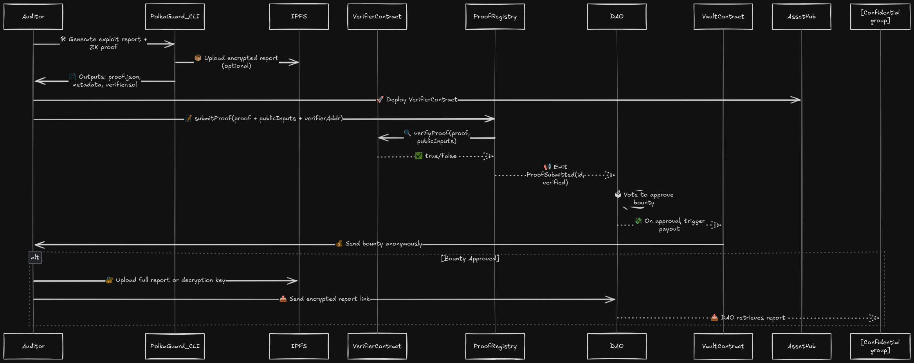

# PolkaGuard‑Council ⚖️

PolkaGuard‑Council is the **token‑gated DAO extension** for PolkaGuard, introducing community‑driven approval and bounty distribution mechanisms. Built as an upgrade to PolkaGuard's CLI toolkit, it empowers PGT (PolkaGuard Token) holders to propose, vote, and authorize bounties in a transparent and secure on‑chain process.olkaGuard‑Council ⚖️

PolkaGuard‑Council is the **token‑gated DAO extension** for PolkaGuard, introducing community‑driven approval and bounty distribution mechanisms. Built as an upgrade to PolkaGuard’s CLI toolkit, it empowers PGT (PolkaGuard Token) holders to propose, vote, and authorize bounties in a transparent and secure on‑chain process.

---

## 🧭 What It Is

PolkaGuard‑Council enables decentralized governance over vulnerability bounties:

- **Token-based access control** — Only users holding PGT can create proposals, vote, or execute actions.
- **Community‑led decision-making** — Funds are released only when token-weighted voting thresholds are met.
- **On-chain orchestration** — Integrates with ExploitProofRegistry and BountyVault for fully on‑chain approval flow.

---

## 🔧 Why It Matters

- **✅ Fair & permissioned**: Ensures only active community members shape bounty decisions.
- **🏅 Aligned incentives**: Token ownership reflects both access and voting influence.
- **🛡️ Secure bounties**: Combines PolkaGuard’s ZK exploit proofs with guarded DAO payouts.
- **🔗 Modular integration**: Extends existing contracts without overhauling PolkaGuard CLI.

---

## 🚀 How It Works with PolkaGuard

PolkaGuard‑Council orchestrates a comprehensive bounty approval workflow that ensures security, anonymity, and community governance:

### 📊 Complete Workflow



### 🔄 Step-by-Step Process

#### Phase 1: Exploit Discovery & Proof Generation

1. **🛠 Generate Report** → Auditor uses PolkaGuard CLI to create exploit report with ZK proof
2. **📦 Optional Encryption** → Upload encrypted report to IPFS for confidentiality
3. **📄 Proof Package** → CLI outputs proof.json, metadata, and verifier contract

#### Phase 2: On-Chain Verification

4. **🚀 Deploy Verifier** → Auditor deploys VerifierContract to AssetHub
5. **📝 Submit Proof** → Submit proof with public inputs and verifier address to ProofRegistry
6. **🔍 Cryptographic Verification** → ProofRegistry calls VerifierContract to validate ZK proof
7. **📢 Event Emission** → ProofSubmitted event triggers DAO notification

#### Phase 3: Community Governance

8. **🗳 DAO Voting** → PGT holders vote on bounty approval through token-weighted voting
9. **💸 Automated Payout** → If approved, DAO triggers VaultContract for anonymous bounty payment
10. **💰 Reward Distribution** → Auditor receives bounty funds automatically

#### Phase 4: Report Disclosure (If Approved)

11. **🔐 Report Release** → Auditor uploads full report or decryption key to IPFS
12. **📤 Secure Sharing** → DAO receives encrypted report link for confidential review
13. **📥 Knowledge Transfer** → Confidential group accesses detailed vulnerability information

### 🎯 Key Benefits

- **🔒 Privacy-First**: ZK proofs enable verification without revealing exploit details
- **⚖️ Community-Driven**: Token holders collectively decide on bounty approvals
- **🤖 Automated**: Smart contracts handle verification and payout without intermediaries
- **🛡️ Secure**: Multi-layer verification ensures only valid exploits receive rewards
- **📊 Transparent**: All governance actions are recorded on-chain for accountability

---

## 🧩 Core Features

### 🔐 Security & Privacy

- **Zero-Knowledge Proofs**: Verify exploits without revealing implementation details
- **Encrypted Report Storage**: Optional IPFS integration for confidential documentation
- **Anonymous Bounty Payouts**: Protect auditor identities during reward distribution

### 🏛️ Decentralized Governance

- **PGT‑Gated Proposal Creation**: Only PGT holders (above threshold) can propose bounty approvals
- **Token‑Weighted Voting**: Voting power proportional to PGT token balance
- **Quorum‑Based Execution**: Enforces minimum participation before executing decisions
- **Transparent Events**: Captures `ProofSubmitted`, `ProposalCreated`, `Voted`, `Executed` events

### 🔗 Smart Contract Integration

- **Automated Verification**: Direct integration with VerifierContract for proof validation
- **Cross-Contract Communication**: Seamless interaction between Registry, DAO, and Vault
- **Fail-Safe Mechanisms**: Built-in checks prevent invalid proofs from receiving rewards

---

## 🛠️ Quickstart

### ✅ Prerequisites

- Deployed: `PolkaGuardToken`, `ExploitProofRegistry`, `BountyVault`.
- Funds deposited in `BountyVault`.
- PGT minted and distributed to community members.
- Configured DAO settings (min_tokens, threshold).

### 👷‍♀️ Complete Workflow Commands

```bash
# Phase 1: Generate exploit proof with PolkaGuard CLI
polkaguard exploit-report --target <contract_address> --output ./proof-package/

# Phase 2: Deploy verifier and submit proof
ink deploy verifier.sol
ink call ProofRegistry submitProof <proof_data> <public_inputs> <verifier_addr>

# Phase 3: Community governance
ink call PolkaGuardCouncil create_proposal <registry_addr> <proof_id>
ink call PolkaGuardCouncil vote <proposal_id> true
ink call PolkaGuardCouncil execute <proposal_id>

# Phase 4: Optional report sharing (post-approval)
ipfs add encrypted_full_report.json
ink call PolkaGuardCouncil share_report <proposal_id> <ipfs_hash>
```

---

## 🔒 Governance Parameters

| Parameter          | Description                                             |
| ------------------ | ------------------------------------------------------- |
| `min_tokens`       | Minimum PGT balance required to propose or vote         |
| `voting_threshold` | Total tokens in favor required to approve a proposal    |
| `token_contract`   | Address of the deployed PolkaGuardToken for vote gating |

---

## 🌟 Use Cases

### 🕵️ Anonymous Security Research

- **Confidential Vulnerability Discovery**: Researchers can prove exploits exist without revealing attack vectors
- **Protected Identity**: Anonymous bounty collection ensures researcher safety
- **Community Validation**: Collective decision-making prevents single points of failure

### 🏛️ Decentralized Security Governance

- **Community-Driven Audits**: Token holders collectively assess vulnerability severity and impact
- **Fair Bounty Distribution**: Transparent voting ensures legitimate researchers receive appropriate rewards
- **Collaborative Security**: Distributed expertise improves vulnerability assessment quality

### 🛡️ Enterprise Security Programs

- **Automated Bug Bounty Programs**: Reduce manual oversight while maintaining security standards
- **Compliance Integration**: On-chain governance provides audit trails for security compliance
- **Scalable Reward Systems**: Handle multiple concurrent vulnerability reports efficiently

---

## 📁 Repository Structure

```
/
├── contracts/
│   ├── PolkaGuardToken/        # PSP22 governance token
│   ├── ExploitProofRegistry/   # ZK proof registry (existing)
│   ├── BountyVault/            # Funds escrow
│   └── PolkaGuardCouncil/      # Token-gated DAO
├── scripts/                    # Deployment & interaction scripts
└── README.md                   # This file
```

---

## 🤝 Contributing

- **Deploy and test** on local AssetHub.
- **Suggest improvements**, e.g. delegated voting or timelock integration.
- **Report issues** or propose features via GitHub.

---

## 📜 License

Released under the **MIT License**. See [LICENSE](LICENSE) for details.

---

## 🙏 Acknowledgments

Built atop the **PolkaGuard** ecosystem by @rtb‑12. Inspired by DAO frameworks like OpenZeppelin, with ink!’s robust tooling.

---

_Become part of the decentralized security revolution — propose. vote. protect. 🚀_

```

```
